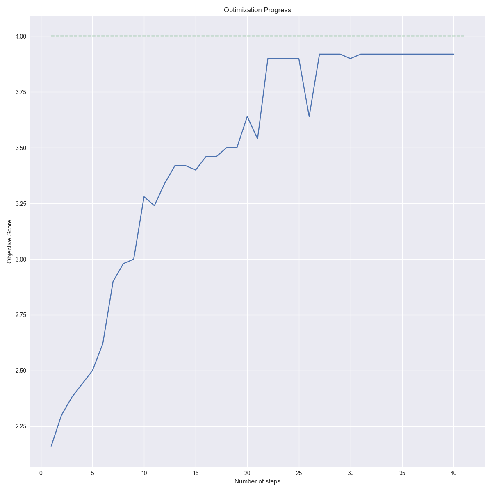

# HW3

[](https://travis-ci.org/david-joy/bmi203-hw3)

David Joy 2/24/2017<br/>

Skeleton for sequencing project

## Assignment - Part 1

1. Implement Smith-Waterman
    - Implemented in [smith_waterman()](https://github.com/david-joy/bmi203-hw3/blob/master/hw3/alignment.py#L26)
    - This function wraps several subfunctions written in Cython for speed in [_alignment.pyx](https://github.com/david-joy/bmi203-hw3/blob/master/hw3/_alignment.pyx)
        - Conversion of python strings and pandas DataFrames to low-level numpy arrays: [_encode_sw_matrix()](https://github.com/david-joy/bmi203-hw3/blob/master/hw3/_alignment.pyx#L6)
        - Dynamic programming calculation implemented: [_calc_sw_matrix()](https://github.com/david-joy/bmi203-hw3/blob/master/hw3/_alignment.pyx#81)
        - Traceback to find the longest local alignment: [](https://github.com/david-joy/bmi203-hw3/blob/master/hw3/_alignment.pyx#L28)
    - Tests for the algorithm in [test_alignment.py](https://github.com/david-joy/bmi203-hw3/blob/master/test/test_alignment.py)
2. It should be able to use any scoring matrix provided
    - Scoring matrix reader implemented in [read_score_matrix()](https://github.com/david-joy/bmi203-hw3/blob/master/hw3/io.py#L13)

## Questions - Part 1

### Question 1

Consider the false positive rate (proportion of negative pairs with scores that exceed a score threshold) when the true positive rate (proportion of positive pairs with scores above the threshold) is 0.7. What's the best false positive rate that you can achieve with varying both gap opening (from 1 to 20) and extension penalties (from 1 to 5) with the BLOSUM50 matrix? What is the best gap penalty combination?

The scores were calculated by scanning all combinations of gap opening and gap extension penalty in [calc_optimal_blosum50.py](https://github.com/david-joy/bmi203-hw3/blob/master/calc_optimal_blosum50.py). The plots below were generated by runnning [plot_optimal_blosum50.py](https://github.com/david-joy/bmi203-hw3/blob/master/plot_optimal_blosum50.py).

Plotting the scores for the true positive rate gives the following distribution of cutoffs:<br />

<br />

Using these cutoffs, the false positive rate for the negative pairs is given by the following distribution:<br />

<br />

By inspection, there are two optimal levels with a 22% false positive rate:

- Set one:
    - Gap opening: -7
    - Gap extension: -3
- Set two:
    - Gap opening -6
    - Gap extension: -5

The following analysis uses a gap opening of -7 and a gap extension of -3.

### Question 2

Using the gap penalties you determined from question 1, which of the provided scoring matrices performs the best, in terms of false positive rate (at a true positive rate of 0.7)? What are the performance rates of each of the matrices? Create a Receiver Operator Curve (ROC) graph which shows the fraction of true positives on the Y axis and the fraction of false positives on the X axis. Include on the graph data for each of the provided matrices. Please take care to make your ROC graphs square, with both X and Y axes limited to the range [0:1]. Note, you can download ROC code from here: http://www.jainlab.org/Public/ucsf-roc.zip. It is not guaranteed to be bug free but it might save you some time.

Using the gap penalties from 1, the scores were calculated in [calc_roc_curves.py](https://github.com/david-joy/bmi203-hw3/blob/master/calc_roc_curves.py) and then plotted using the code in [plot_roc_curves.py](https://github.com/david-joy/bmi203-hw3/blob/master/plot_roc_curves.py). This gives the following set of ROC curves:<br />

<br />

Reading off the False Positive rate at a 70% True Positive Level:

- **BLOSUM50: 22%**
- BLOSUM62: 28%
- MATIO: 36%
- PAM100: 30%
- PAM250: 32%

So BLOSUM50 has the best spread at the 70% level as well as being in the top three over the entrie range of values tested. As expected, the MATIO matrix performs worst overall.

### Question 3

How does the performance change if you normalize the Smith-Waterman scores by the length of the shortest sequence in a pair (i.e. divide the raw score by the min length)? Show the ROC curves for your best matrix and for the same matrix with normalized scores. Are the false positive rates better or worse? Why do you think this is so?

Plotting the normalized scores gives a very different ROC curve:<br />

<br />

Reading off the False Positive rate at a 70% True Positive Level:

- **BLOSUM50: 80%**
- BLOSUM62: 88%
- **MATIO: 80%**
- PAM100: 86%
- PAM250: 82%

These curves are more or less indistinguishable from noise, indicating that normalizing the score strongly reduces its ability to distinguish the positive and negative pairs. Comparing the distributions:

<br />

<br />

Shows that the unnormalized positive distribution has a long tail and a slight bias towards higher scores, while the negative distribution has a much smaller spread and a slightly lower overall mean. Normalizing appears to scale the two distributions so that their extents match, destroying the bias that allows us to distinguish positive and negative examples.<br />

Looking at the length distributions for positive and negative examples, the positive examples have a bias towards higher length sequences. Since it's easier to find a local match if the two sequences are longer, this correction may actually be removing a real bias in our training dataset which would indicate that the two classes are actually indistinguishable.<br />


## Assignment - Part 2

Using the best gap penalties and matrix from part 1, create an alignment for each positive pair
of sequences and each negative pair of sequences. You will use these static alignments as a
starting point from which to optimize a scoring matrix to maximize separation of scores of the
positive and negative pairs.

Using the **BLOSUM50** matrix, gap opening of **-7** and gap extension of **-3**, the sequences were aligned with the code in [align_pairs.py](https://github.com/david-joy/bmi203-hw3/blob/master/align_pairs.py). The positive pair alignments are in [pospairs_BLOSUM50.fa](https://github.com/david-joy/bmi203-hw3/blob/master/alignments/pospairs_BLOSUM50.fa) and the negative pair alignments are in [negpairs_BLOSUM50.fa](https://github.com/david-joy/bmi203-hw3/blob/master/alignments/negpairs_BLOSUM50.fa).

## Questions - Part 2

### Question 1

Devise an optimization algorithm to modify the values in a starting score matrix such as to maximize the following objective function: sum of TP rates for FP rates of 0.0, 0.1, 0.2, and 0.3. The maximum value for the objective function is 4.0 (where you are getting perfect separation of positive and negative pairs even at the lowest false positive rate). You should use the gap and extension penalties derived from Part 1. Remember, you must maintain symmetry in your matrix. You can make use of real-valued scores in the matrices if desired (this is probably a good idea).

The optimization algorithm calculates the log odds of a set of alignments to generate a new score matrix, weighted by those alignments scores. To increase the number of true positives and decrease the number of false positives, it calculates a score gradient as the difference between the positive score matrix and the negative score matrix. Finally, the algorithm does adaptive gradient descent to iteratively update the score matrix until either a score of **4.0** is achived, the update step size falls below **1e-4**, or the algorithm has run for 200 steps. The step size is adjusted downwards each time the optimization score falls below the median of a running window of past scores.

- The optimization metric: [score_matrix_objective()](https://github.com/david-joy/bmi203-hw3/blob/master/hw3/optimize.py#L24)
- Calculation of the alignment gradient: [calc_score_gradient()](https://github.com/david-joy/bmi203-hw3/blob/master/hw3/optimize.py#L162)
- Calculation of the log-odd matrix for a set of alignments: [calc_distribution()](https://github.com/david-joy/bmi203-hw3/blob/master/hw3/optimize.py#L51)

Several weighting schemes were tested to optimize the matrix

- Weigh all examples equally (default argument)
    - Fails to optimize BLOSUM50 beyond a score of **~2.4**
- Weigh examples by distance from the best/worst negative/positive example: [triangle_weight()](https://github.com/david-joy/bmi203-hw3/blob/master/hw3/optimize.py#L90)
    - Fails to optimize BLOSUM50 beyond a score of **~2.6**, sometimes reduces the score to **< 2.0**
- Only use the 10 lowest scoring positive examples and the 10 highest scoring negative examples: [top_k_weight()](https://github.com/david-joy/bmi203-hw3/blob/master/hw3/optimize.py#L136)
    - Optimizes BLOSUM50 to **> 3.9** and occasionally gets a perfect score.
    - This was the gradient weighting scheme used for the following questions.

The main optimization script is implemented in [optimize_score_matrix.py](https://github.com/david-joy/bmi203-hw3/blob/master/optimize_score_matrix.py). Usage

```
python optimize_score_matrix.py --score-file ./data/SCORE_FILE
```

The optimal score file will be written to ``./data/SCORE_FILE_OPT`` and a plot of the objective function with each optimization step will be written to ``./plots/opt_trajectory_SCORE_FILE.png``.

### Question 2

Beginning from the best matrix from above (that which produced the alignments), run your optimization algorithm to maximize the fitness of the new matrix. How much improvement do you see in the fitness? Show the full ROC curves for the original matrix and the optimized matrix. What happens when you now realign the sequences using the new matrix and rescore? Show the new ROC curve following realignment on the same graph as above. Qualitatively discuss how your matrix and your alignments change following optimization.

Using the top 10 weighting of alignments described above, the fitness improves dramtically:<br />

<br />

This creates an almost perfect ROC curve:<br />

<br />

Looking at the distribution, this effect mainly comes from suppressing the negative scores:<br />

<br />

Which results in a reduced length of negative alignments, without affecting the positive alignments:<br />

<br />

Interestingly, it has no effect on the normalized ROC curve:

<br />

Which suggests that we're still not optimizing for an effect that survives correcting for sequence length.

### Question 3

Beginning from the MATIO matrix, but using the same initial sequence alignments, re-run the optimization. Show the same ROC plots as for (2). Discuss the relationship between the results you see here and the results you saw for (2).

### Question 4

Describe your optimization algorithm briefly. How might you improve it?

The optimization works because it exploits the fact that the objective function only cares about the difference between the worst positive example and the best negative example. By updating the score matrix to better separate the marginal cases, the marginal positive scores increase and the marginal negative scores decrease until they separate. The current algorithm uses a fixed window, which works quite well initially, but becomes slow when there is one positive example with a poor score and the rest are well separated. A better algorithm would probably reduce the window size as we get close to convergence.

### Question 5

What would be required in order to make a convincing case that an optimized matrix will be of general utility and will actually be beneficial for people to use in searching databases?

If the score matrix was good at separating a new set of positive and negative examples with minimal similarity to the supplied set of positive and negative examples, especially if those examples didn't have a length bias like the current set, then I would have some confidence that it was a more generally useful scoring matrix.

## structure

The main algorithm for Smith-Waterman is implemented in [alignment.py](https://github.com/david-joy/bmi203-hw3/blob/master/hw3/alignment.py) with a Cythonized implementation of dynamic programming in [_alignment.pyx](https://github.com/david-joy/bmi203-hw3/blob/master/hw3/_alignment.pyx) for speed. The optimizer is implemented in [optimize.py](https://github.com/david-joy/bmi203-hw3/blob/master/hw3/optimize.py). Code for reading and writing files is in [io.py](https://github.com/david-joy/bmi203-hw3/blob/master/hw3/io.py).

```
.
├── README.md
├── data
├── plots
│   ...
├── hw3
│   ├── __init__.py
│   ├── alignment.py
│   ├── _alignment.pyx
│   ├── optimize.py
│   └── io.py
└── test
    ├── test_alignment.py
    ├── test_optimize.py
    └── test_io.py
```

## usage

To use the package, first run

```
conda install --yes --file requirements.txt
```

to install all the dependencies in `requirements.txt`.

## testing

Testing is as simple as running

```
python -m pytest
```

from the root directory of this project.


## contributors

Original design by Scott Pegg. Refactored and updated by Tamas Nagy.
